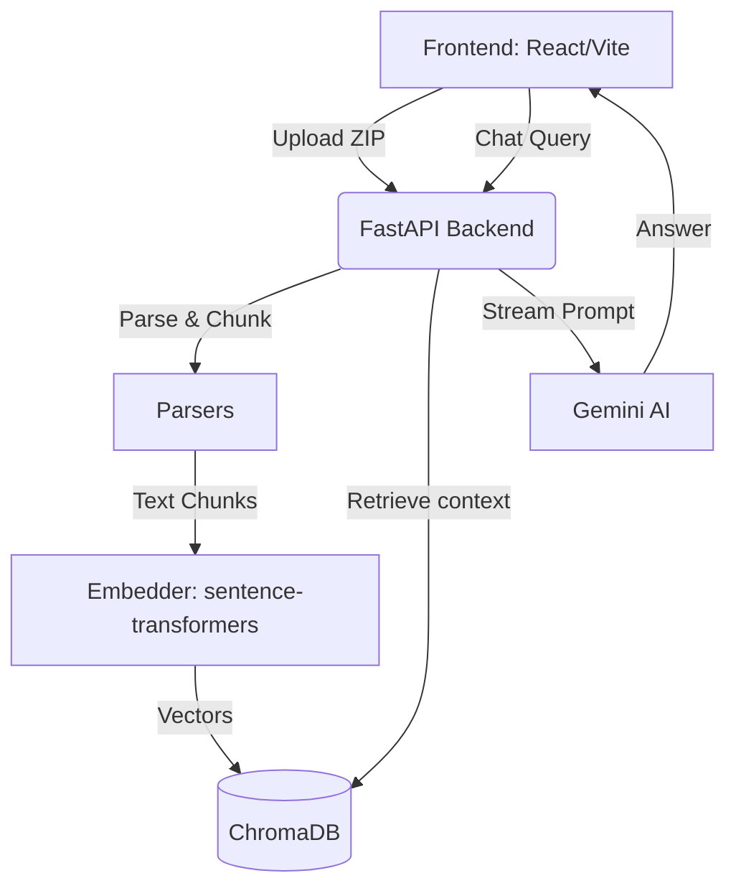
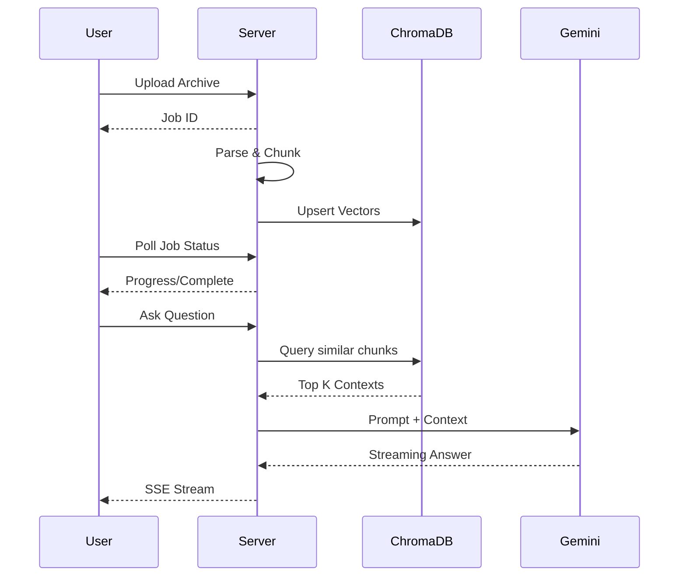

# Cortex

End-to-end social data ingestion, vector knowledge base, and RAG chat interface.

## 1. The Problem

People generate massive amounts of text on social platforms (LinkedIn, Twitter, Instagram) over the years. However, they lack a unified, private, and intelligent way to search, query, or interact with their own digital footprint. Traditional search tools are keyword-based and siloed per platform, making it impossible to surface nuanced thoughts or synthesize ideas across different networks.

## 2. The Solution

Cortex is a local-first system that ingests data exports from various social networks, builds a unified vector knowledge base, and provides a Retrieval-Augmented Generation (RAG) chat interface. It allows users to "talk to their digital self" by grounding a powerful AI model in their actual historical writing.

## 3. Innovation

- **Zero-Config Local AI**: Embedding and vector storage happen entirely locally without complex infrastructure or paid APIs.
- **Content-Aware Processing**: Intelligently parses unstructured platform exports into semantic chunks rather than blind character counts.
- **Unified Social Abstraction**: Treats all social networks as an extensible interface, normalizing disparate export formats into a single knowledge graph.

## 4. Features

- **Drag-and-Drop Ingestion**: Seamlessly upload ZIP exports from LinkedIn, Twitter, and Instagram.
- **Async Background Processing**: Non-blocking ingestion handles thousands of posts while the UI remains responsive.
- **Streaming Chat Interface**: Real-time SSE (Server-Sent Events) chat responses grounded in retrieved contexts.
- **Source Citations**: Every AI response traces back to the exact post or article it was derived from.
- **Live Statistics**: Real-time breakdown of knowledge base composition and processing progress.

## 5. User Journey

1. **Export**: The user requests a data export archive from their social media platforms.
2. **Ingest**: The user uploads the ZIP archive directly into the Cortex UI.
3. **Process**: Cortex parses the unstructured data, intelligently chunks it, generates embeddings locally, and stores them in ChromaDB.
4. **Query**: The user asks a natural language question (e.g., "What were my main thoughts on generative AI in 2023?").
5. **Synthesize**: Cortex retrieves the most relevant posts, injects them as context to the Gemini AI, and streams back a synthesized answer with citations.

## 6. System Architecture



## 7. Workflow & Orchestration

The orchestration happens within the FastAPI backend utilizing async tasks to prevent blocking the main event loop. 
- **Ingestion Job Queue**: Uploaded archives are assigned a Job ID and pushed to a thread-pool executor.
- **Polling Mechanism**: The frontend polls the job status at 800ms intervals, retrieving progress updates without heavy WebSocket dependencies.

## 8. Data Flow & State Management



## 9. Tech Stack

- **Backend**: Python, FastAPI
- **Vector Database**: ChromaDB (Embedded)
- **Embeddings**: `sentence-transformers` (`all-MiniLM-L6-v2`)
- **AI / LLM**: Google Gemini API
- **Frontend**: React, TypeScript, Vite

## 10. AI Deep Dive — Gemini

Cortex utilizes **Gemini** for the generation phase of the RAG pipeline. Gemini's large context window, fast time-to-first-token (TTFT), and strong reasoning capabilities make it ideal for synthesizing scattered social media posts into coherent, accurate answers. By injecting the retrieved context directly into the Gemini prompt, we eliminate hallucination and ensure responses are strictly grounded in the user's historical data.

## 11. Impact & Real-World Use Cases

- **Personal Knowledge Management**: Instantly recall specific articles, opinions, or resources shared years ago.
- **Content Repurposing**: Authors and creators can query their past thoughts to generate outlines for new content.
- **Digital Twin**: Create an interactive AI persona trained strictly on your own historical writing.

---

## 12. Quick start (Installation & Setup)

```powershell
# 1. Copy env and add your Gemini key (free at https://aistudio.google.com/apikey)
cp .env.example .env
# edit .env — set GEMINI_API_KEY

# 2. Install Python deps
pip install -r requirements.txt

# 3. Start backend (port 8000)
python run.py

# 4. In another terminal — start frontend (port 5173)
cd frontend
npm install && npm run dev
```

Or run `.\start.ps1` to do all of the above automatically.

**Note:** On first run, sentence-transformers downloads the embedding model (~90 MB). Subsequent starts are instant.

---

## 13. Architecture Write-Up

**What does the system do, and what are the two or three most important architecture decisions?**

Cortex ingests social media exports from LinkedIn (CSV), Twitter/X (JS archive), and Instagram (JSON), builds a persistent local vector knowledge base from the authored content, and answers natural-language questions about the person grounded in their actual writing via a streaming RAG chat interface. The three most important decisions were: (1) **ChromaDB + sentence-transformers locally** — ChromaDB runs embedded in-process with zero external dependencies, and `all-MiniLM-L6-v2` produces 384-dimensional embeddings at zero cost with no API key; the tradeoff is CPU-bound inference speed vs. a hosted service, but for a system where setup friction matters most, this is the right call. (2) **Content-aware chunking, not fixed character counts** — tweets and short posts are kept as atomic units because they express a complete thought, while longer content is split at paragraph boundaries with 150-character overlap; fixed-size splits would shred sentences mid-thought and corrupt retrieval. (3) **Async background ingestion with progress polling** — LinkedIn ZIPs can exceed 50 MB and contain thousands of posts; running embedding synchronously would block the HTTP server and time out the client, so FastAPI's `BackgroundTasks` and a thread-pool executor keep the server responsive while the frontend polls a lightweight job-status endpoint.

**Where is the bottleneck at 10× data volume? What breaks first?**

The embedding step breaks first. `sentence-transformers` on CPU embeds roughly 300–500 chunks per second; at 10× volume (≈100 K chunks) that is 3–6 minutes of wall time — slow but survivable in a background job. The next failure point is `get_stats()` in `vectorstore.py`, which reads all metadata into memory to count sources: at 500 K+ chunks this becomes a multi-second blocking call that stalls the API. Beyond that, ChromaDB's in-process HNSW index loads fully into RAM at query time — at 1 M+ vectors on a typical laptop, memory pressure becomes the hard ceiling. None of these are architectural dead-ends; they are sequenced, fixable scaling steps.

**What did you consciously cut to stay in the 4–6 hour window, and what would you build next?**

Deliberately cut: multi-user isolation (the knowledge base is single-tenant — all uploads share one ChromaDB collection); metadata pre-filtering on queries (retrieval is pure semantic ANN with no date or source `where`-clauses); HTML-format Instagram export parsing (only JSON handled); persistent job history (jobs live in-process memory and vanish on server restart); and hybrid search (pure ANN misses exact keyword and name matches). The next things to build — in priority order — are: hybrid BM25 + semantic search with Reciprocal Rank Fusion (the single biggest retrieval quality win), source/date filter support using ChromaDB's `where` clauses, a SQLite-backed job store for durability, and WebSocket push to replace the polling loop.

**If you had to make this architecture 10× better — not iterate on it, but rethink it — what would you change and why?**

Replace ChromaDB and sentence-transformers with **pgvector inside Postgres** and a hosted embedding model (OpenAI `text-embedding-3-large` or equivalent). The reason isn't just scale — it's that Postgres gives you SQL JOINs for rich metadata queries, ACID transactions for safe incremental upserts, full-text search you can blend with ANN via Reciprocal Rank Fusion, and connection pooling, all in one system you already operate. Move ingestion to a durable job queue (Celery + Redis, or a pg-backed worker) so uploads survive restarts and can be retried. Add a cross-encoder re-ranking pass over the top-20 ANN candidates before generating — re-ranking is where retrieval quality improves most dramatically for nuanced opinion queries, and it costs almost nothing in latency. Finally, restructure the RAG prompt to exploit Gemini's long context window more aggressively: rather than passing only top-6 chunks, pass a larger diverse set and let the model do its own synthesis — trading token cost for recall quality.

---

## 14. Project structure

```
cortex/
├── backend/
│   ├── config.py          — Pydantic settings (env vars)
│   ├── parsers/
│   │   ├── base.py        — ParsedContent dataclass + BaseParser ABC
│   │   ├── linkedin.py    — Posts.csv, Profile.csv, Articles.csv, Comments.csv
│   │   ├── twitter.py     — tweets.js / tweet.js archive
│   │   └── instagram.py   — posts_N.json, stories.json
│   ├── chunker.py         — Content-aware chunking with paragraph overlap
│   ├── embedder.py        — sentence-transformers, batched, async executor
│   ├── vectorstore.py     — ChromaDB wrapper (upsert / query / stats / reset)
│   ├── rag.py             — Retrieve → format context → stream from Gemini
│   └── main.py            — FastAPI app (ingest, chat, stats endpoints)
├── frontend/
│   └── src/
│       ├── App.tsx
│       └── components/
│           ├── ChatInterface.tsx   — SSE streaming chat with source citations
│           ├── UploadPanel.tsx     — Drag-and-drop ZIP upload with progress
│           └── StatsPanel.tsx      — Chunk count + source breakdown
├── run.py                 — uvicorn entry point
├── start.ps1              — One-shot startup script (Windows)
├── requirements.txt
└── .env.example
```

## 15. Adding a fourth parser

1. Create `backend/parsers/yourplatform.py`, subclass `BaseParser`
2. Implement `can_parse(names)` (inspect ZIP file list) and `parse(zf)` (return `list[ParsedContent]`)
3. Add the class to the `PARSERS` list in `backend/main.py`

That is the only change required — chunking, embedding, and storage are source-agnostic.
